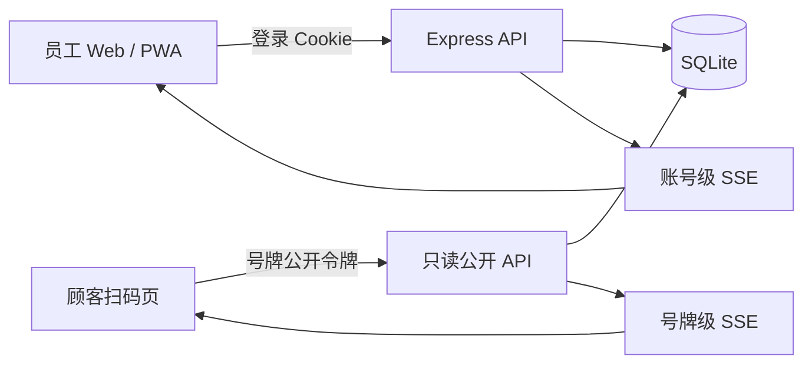
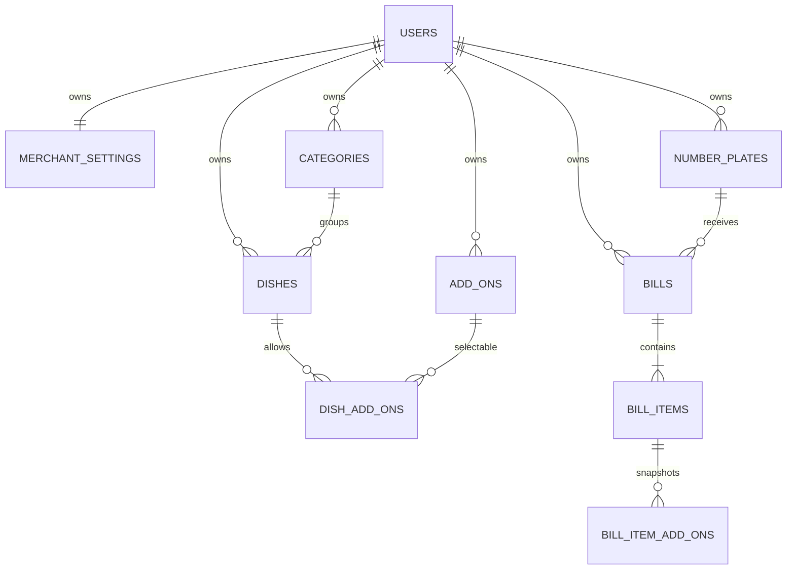
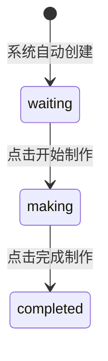

# 号牌账单、后厨拆单、顾客进度与结算技术设计

## 1. 设计目标

本次改造将现有“一个号牌对应一条队列订单”的模型替换为“一个号牌对应一张未结算账单，账单包含多条菜品任务”。设计必须同时保证：

- 同一号牌可持续加菜，金额始终一致；
- 后厨每条菜品任务只有“待制作 → 制作中 → 已完成”两个需要点击的转换；
- 全部菜品完成后才能结算，重复结算不会重复记账；
- 顾客通过长期固定的号牌二维码，只能查看本号牌当前账单；
- 同一账号多设备实时同步，不同账号严格隔离；
- 统计和导出以已结算账单为准；
- 当前测试数据库可安全地显式重建为 `yue / 123` 和指定菜单种子。

## 2. 总体架构

继续使用现有 React + Express + SQLite + SSE 技术栈，不引入外部云服务。业务数据从 `workspaces.data_json` 迁移为规范化 SQLite 表；项目未上线，因此不实现旧业务数据迁移，只提供显式测试库重建命令。



模块边界：

- `server/database.js`：建表、连接、事务和查询仓储，不再读写整个工作空间 JSON。
- `server/index.js`：认证、业务校验、API 路由、SSE 广播和静态页面入口。
- `server/analytics.js`：从已结算账单及明细构建统计。
- `server/order-export.js`：从账单层级生成 CSV/JSON，金额转换为元。
- `server/seed/`：提交经过清洗的 `mwb` 菜单种子，不包含备份数据库、账号、会话、订单或历史。
- `scripts/reset-demo-database.js`：只在明确传入确认参数时重建测试数据库。
- `src/App.jsx`：员工端四项主导航和顾客公开页路由。
- `src/api.js`：员工端、结算端和顾客公开端请求封装。

## 3. 数据模型

### 3.1 实体关系



### 3.2 表结构

所有业务表使用 SQLite `STRICT` 模式、外键约束和 ISO 8601 UTC 时间；金额统一存整数分。

#### `users` 与 `sessions`

保留现有认证字段和 7 天 HttpOnly 会话。所有商家业务表必须包含 `user_id`，服务端从登录会话注入，不接受客户端提交账号 ID。

#### `merchant_settings`

| 字段 | 说明 |
| --- | --- |
| `user_id` | 主键及账号外键 |
| `sound_enabled` | 新任务提示音 |
| `payment_qr_blob` | 可空的收款码图片二进制 |
| `payment_qr_mime` | `image/png`、`image/jpeg` 或 `image/webp` |
| `payment_qr_updated_at` | 收款码更新时间 |

收款码直接存 SQLite BLOB，避免文件路径同步、Docker 卷遗漏和额外上传依赖。状态接口只返回是否已配置和图片 URL，不把图片塞入 JSON。

#### `categories`

| 字段 | 说明 |
| --- | --- |
| `id` | 稳定分类 ID |
| `user_id` | 所属账号 |
| `name` | 当前名称，同账号内唯一 |
| `sort_order` | 点菜及管理页顺序 |
| `created_at` / `updated_at` | 时间 |

菜品通过 `category_id` 关联分类。分类改名只修改本表，因此当前菜单立即更新；已生成账单明细使用快照，不受影响。

#### `dishes`、`add_ons` 与 `dish_add_ons`

- `dishes`：`id`、`user_id`、`category_id`、名称、说明、`price_cents`、启用状态、排序和时间。
- `add_ons`：`id`、`user_id`、名称、`price_cents`、启用状态、排序和时间。
- `dish_add_ons`：菜品和可选小料的多对多关系，复合唯一键阻止重复关系。

服务端在建立关系时同时校验菜品、小料和分类属于当前账号。

#### `number_plates`

| 字段 | 说明 |
| --- | --- |
| `id` | 内部稳定 ID |
| `user_id` | 所属账号 |
| `number` | 1–999 的号牌数字，同账号内唯一 |
| `public_token` | 至少 256 位随机熵的 Base64URL 令牌，全局唯一 |
| `sort_order` | 号牌显示顺序 |
| `created_at` | 创建时间 |

二维码 URL 形如 `/p/{publicToken}`。令牌不会包含账号 ID、号牌 ID 或号牌数字；删除号牌会使令牌失效。只要号牌未删除，编辑其他设置和多次结算都不会改变二维码。

#### `bills`

| 字段 | 说明 |
| --- | --- |
| `id` | 账单 ID |
| `user_id` | 所属账号 |
| `number_plate_id` | 号牌关联；历史允许保留空外键 |
| `number_snapshot` | 下单时号牌数字 |
| `status` | `open` 或 `settled` |
| `total_cents` | 当前/最终总额缓存 |
| `opened_at` | 第一条菜创建时间 |
| `settled_at` | 结算时间，可空 |

使用部分唯一索引保证每个账号、每个号牌最多一张 `open` 账单：

```sql
CREATE UNIQUE INDEX one_open_bill_per_plate
ON bills(user_id, number_plate_id)
WHERE status = 'open';
```

#### `bill_items`

每条记录既是账单菜品明细，也是后厨任务：

| 字段 | 说明 |
| --- | --- |
| `id` / `bill_id` / `user_id` | 身份和归属 |
| `source_dish_id` | 下单时菜品 ID 字符串，用于同菜筛选，不依赖菜品继续存在 |
| `category_name_snapshot` | 品类名称快照 |
| `dish_name_snapshot` / `dish_note_snapshot` | 菜品快照 |
| `base_price_cents` | 单份基础价 |
| `add_on_unit_cents` | 单份小料合计 |
| `unit_total_cents` | 单份总价 |
| `quantity` | 份数，1–99 |
| `line_total_cents` | 行金额 |
| `status` | `waiting`、`making`、`completed` |
| `created_at` / `started_at` / `completed_at` | 下单及制作时间 |

#### `bill_item_add_ons`

保存每条菜品任务的小料 ID、名称和单价快照。小料之后改名、改价或删除均不影响已下单数据。

### 3.3 金额不变量

- `unit_total_cents = base_price_cents + add_on_unit_cents`
- `line_total_cents = unit_total_cents × quantity`
- `bill.total_cents = SUM(bill_items.line_total_cents)`

新增菜品时在一个事务内插入账单、明细、小料快照并更新账单总额。结算前重新计算一次明细合计并与缓存比较；若不一致则以明细合计修正后再结算。

## 4. 事务与状态机

### 4.1 向号牌加菜

使用 `BEGIN IMMEDIATE` 串行化同一数据库的写入：

1. 校验号牌、菜品和小料属于当前账号且已启用。
2. 查询该号牌的 `open` 账单；没有则创建。
3. 从当前菜单生成不可变价格与名称快照。
4. 插入一条 `waiting` 菜品任务和小料快照。
5. 原子更新账单总额并提交。
6. 提交成功后再向当前账号和该号牌顾客页广播 SSE。

并发设备同时为同一号牌第一次加菜时，部分唯一索引阻止生成两张未结算账单；服务端捕获冲突后重新读取已创建账单并重试插入明细。

### 4.2 后厨两步状态机



- `PATCH /api/kitchen/tasks/:id` 只接受 `start` 或 `complete`。
- `start` 使用条件更新 `WHERE status = 'waiting'`；`complete` 使用 `WHERE status = 'making'`。
- 状态不匹配时返回 `409` 和最新任务状态，避免双击或多设备重复操作。
- 单菜批量开始/完成使用同样的条件更新并在一个事务内执行，不增加第三个状态或按钮。
- 完成菜品只更新任务，不归档、不释放号牌、不累计营业额。

### 4.3 结算

`POST /api/bills/:id/settle` 在事务中执行：

1. 按 `bill.id + user_id` 查询账单。
2. 如果已经结算，直接返回现有结算结果，保持幂等。
3. 查询是否存在非 `completed` 菜品；存在则返回 `409` 和未完成数量。
4. 校验并固化最终金额。
5. 条件更新 `status = settled`、`settled_at = now`。
6. 提交后广播员工状态和号牌公开状态。

结算后号牌不再有 `open` 账单，下一次加菜自动创建新账单。历史账单不移动、不删除，通过状态和结算时间查询。

## 5. API 设计

### 5.1 员工认证接口

继续沿用：

- `GET /api/auth/me`
- `POST /api/auth/register`
- `POST /api/auth/login`
- `POST /api/auth/logout`

### 5.2 员工业务接口

| 方法与路径 | 用途 |
| --- | --- |
| `GET /api/state` | 分类、菜品、小料、号牌、未结算账单及任务 |
| `GET /api/events` | 当前账号完整状态 SSE |
| `POST /api/number-plates/:id/items` | 为号牌创建/复用未结算账单并加菜 |
| `PATCH /api/kitchen/tasks/:id` | `start` 或 `complete` |
| `PATCH /api/kitchen/tasks/batch` | 按 `sourceDishId` 批量开始或完成 |
| `GET /api/bills?status=open|settled` | 结算列表与历史分页 |
| `POST /api/bills/:id/settle` | 幂等结算 |
| `POST /api/categories` | 新建大类 |
| `PATCH /api/categories/:id` | 大类改名 |
| `PUT /api/categories/order` | 大类排序 |
| `POST/PATCH/DELETE /api/dishes` | 菜品管理 |
| `POST/PATCH/DELETE /api/add-ons` | 小料管理 |
| `POST/DELETE /api/settings/payment-qr` | 上传或删除收款码 |
| `GET /api/settings/payment-qr` | 员工端查看收款码 |
| `GET /api/number-plates/:id/qr.svg` | 下载可打印号牌二维码 |
| `GET /api/analytics` | 已结算账单统计 |
| `GET /api/order-exports` | CSV/JSON 导出 |

收款码上传使用原始图片请求体，限制 2 MB，仅接受 PNG/JPEG/WebP；不引入 multipart 库。

### 5.3 顾客公开接口

公开接口必须注册在通用 `/api` 登录中间件之前：

| 方法与路径 | 用途 |
| --- | --- |
| `GET /api/public/plates/:token/progress` | 当前号牌账单的只读进度 |
| `GET /api/public/plates/:token/events` | 该号牌进度 SSE |
| `GET /api/public/plates/:token/payment-qr` | 当前商家收款码图片 |

公开响应只包含：号牌数字、当前账单 ID、菜品快照、份数、小料、行金额、总额、制作状态、整体完成数和排队信息。不得包含用户名、用户 ID、其他号牌、其他账单或管理字段。

待制作任务的排队位置按同一账号、同一 `source_dish_id`、同为 `waiting` 的任务，以 `created_at + id` 稳定排序计算。制作中和已完成任务不显示排队名次。

## 6. 二维码与公开页安全

- 公开令牌使用 `crypto.randomBytes(32).toString('base64url')` 生成。
- 路由只按完整令牌精确查询，令牌无效统一返回 404，不提示账号或号牌是否存在。
- 公开页面和 API 使用 `Cache-Control: no-store`、`Referrer-Policy: no-referrer` 和合理的内容安全策略。
- SSE 客户端按 `number_plate_id` 单独登记；广播只发送该号牌重新读取后的公开视图。
- 号牌无未结算账单时只返回“暂无进行中的订单”，绝不回传上一张历史账单。
- 图片接口只在令牌有效且商家已配置收款码时返回内容。
- 二维码 SVG 在服务器本地生成，不调用第三方二维码网站；使用锁定版本的 `qrcode` npm 包。
- 生产环境用 `PUBLIC_BASE_URL` 生成二维码目标地址；未配置时仅在开发环境从请求来源推导，避免 Host 头污染正式二维码。

## 7. 统计与导出

- 营业额：所选结算时间范围内 `settled` 账单的 `total_cents` 之和。
- 完成订单数：已结算账单数，而不是菜品任务数。
- 平均客单：营业额 ÷ 已结算账单数。
- 菜品销量：已结算账单内明细的 `quantity` 之和。
- CSV：一条菜品任务一行，同时重复账单级字段，便于 Excel 筛选。
- JSON：保持 `bill -> items -> addOns` 层级，便于 AI 分析。
- 导出金额字段名使用 `金额（元）` 或 `amountYuan`，值为两位小数字符串/数值，不附加“人民币”或 `CNY` 文案。
- 时间范围继续使用左闭右开区间 `[from, to)`，以 `settled_at` 过滤。

## 8. 测试数据初始化

### 8.1 清洗后的种子

从本地、未跟踪的 `restaurant-2026-07-15-094237.sqlite` 只读提取 `mwb` 工作空间中的：

- 4 个大类及其首次出现顺序；
- 35 个菜品及价格、说明、启用状态和排序；
- 24 个小料及价格、启用状态和排序；
- 菜品与可选小料关系；
- 1–40 号牌配置。

提取结果保存为经过人工核对的 JSON/JS 种子文件并提交。原 SQLite 备份、账号凭据、13 条队列记录和 36 条历史记录不进入 Git。

### 8.2 显式重建命令

新增命令：

```bash
npm run db:reset-demo -- --confirm-reset
```

脚本行为：

1. 没有 `--confirm-reset` 时拒绝执行。
2. 检查目标数据库路径并提示必须先停止服务。
3. 删除目标数据库及自身的 WAL/SHM 文件，不触碰源备份。
4. 建立新表，只创建 `yue / 123`，密码仍通过现有哈希算法存储。
5. 导入清洗后的菜单、小料、关联和号牌；账单、任务、历史、会话为空。
6. 普通注册继续使用原密码强度规则。

该命令不会出现在容器启动命令中。Docker 更新和日常重启永远不会自动清库。

## 9. 界面设计规范

### 9.1 Design Specification

1. **Purpose Statement**：这是餐厅忙碌现场使用的 Web/PWA 工作台和顾客扫码进度页。员工界面优先操作速度、状态辨识和低误触；顾客页优先当前菜品进度、价格与付款信息，不加入营销内容。
2. **Aesthetic Direction**：工业/实用主义。扁平、明确、像可靠的餐厅工具；依靠字号、边框、分隔和状态文字建立层级，不依赖投影或装饰图。
3. **Color Palette**：`#FFFFFF` 页面、`#292D34` 主文字、`#2F6B4F` 操作强调、`#EDF5F0` 进行中背景、`#202020` 主按钮、`#D14343` 错误。沿用项目已批准的绿色品牌令牌，不使用紫色和渐变。
4. **Typography**：`PingFang SC`、`Microsoft YaHei`、`Noto Sans CJK SC`。这是对通用字体限制的窄范围品牌覆盖：中文工作台必须离线可用、不能依赖国外字体源，并延续现有视觉；数字使用等宽数字特性 `font-variant-numeric: tabular-nums`。
5. **Layout Strategy**：桌面端采用偏操作区的非对称双栏，主列表约占 60–70%，详情/账单约占 30–40%；移动端按任务顺序单列并用底部固定操作区。号牌矩阵保持高密度，结算页用列表与详情主次分区，不使用居中展示型卡片墙。

目标平台为响应式 Web/PWA。继续使用 Phosphor 图标，不使用 Emoji。保留现有无投影、无大面积渐变、10/16px 两级圆角体系。

### 9.2 信息架构

主导航固定为：

1. **点菜**：号牌选择、已有账单摘要、品类、菜品、小料、份数、确认加菜。
2. **出餐**：按全部或菜品筛选的未完成任务，两步制作操作。
3. **结算**：未结算号牌、总额、完成进度、账单详情和确认结算。
4. **我的**：数据看板、菜品管理、小料库、工作台设置、号牌二维码和收款码。

顾客扫码页是独立公开路由，不显示员工导航、登录入口或管理操作。

### 9.3 点菜页

- 空闲号牌：白底、灰边、仅显示号码和“空闲”。
- 进行中号牌：浅绿色底、绿色边框，同时显示“进行中”和当前金额；仍保持可点击。
- 不再出现锁图标、禁用态或“使用中不可选”。
- 选择进行中号牌后，右侧/移动端摘要先显示已有账单明细与总额，新选择的菜品作为“本次加菜”单独突出。
- 提交成功后显示“已加入 XX 号牌”，随后回到号牌列表；用户可再次进入同一号牌。

### 9.4 出餐页

- 顶部先显示“全部”，之后按菜品顺序显示筛选标签；标签同时显示任务数和总份数。
- 卡片首要信息为菜品名和份数，号牌作为醒目标识，小料紧随菜品，不展示整桌账单总额。
- 右侧信息区显示等待时间和队列圆形序号；布局保持左右平衡。
- `waiting` 只显示黑色“开始制作”；`making` 只显示绿色“完成制作”。
- 已完成任务立即离开后厨主队列，但仍留在该号牌账单和顾客进度页。

### 9.5 结算页

- 桌面端左侧为未结算号牌列表，右侧为选中账单详情；移动端先列表，点击后进入详情。
- 列表项显示号牌、总额、完成菜品数/总菜品数和“制作中/可结算”文字状态。
- 详情按加菜时间列出菜品、份数、小料、行金额和制作状态，底部固定显示总额。
- 未完成时主按钮禁用并写明“还有 X 道菜未完成”；全部完成后变为“确认结算 ¥XX”。
- 已结算记录放在次级切换中，不抢占当前收银任务。

### 9.6 我的与二维码管理

- 菜品大类以紧凑行展示，点击铅笔进入原位编辑，不使用大面积固定表单。
- 号牌设置中，每个号牌增加二维码按钮；支持单张预览和下载 SVG。
- 收款码设置显示当前缩略图、替换和移除操作，上传前在浏览器校验类型和大小。

### 9.7 顾客扫码页

- 顶部只显示大号号牌、整体完成进度和账单总额。
- 菜品按下单时间排列；每行显示菜品、份数、价格和“前面 X 单/制作中/已完成”。
- 状态同时使用文字、图标和颜色，不能只靠颜色。
- 收款码位于订单内容之后，配短标题“付款请扫码”，不加入支付成功按钮或虚假支付状态。
- 没有进行中账单时只显示号牌和“暂无进行中的订单”，不保留上一单内容。
- 触控目标至少 48px，正文不小于 15px，金额和号牌使用等宽数字。

## 10. 实时同步

- 员工 SSE 继续按 `user_id` 隔离，任何事务提交后只广播所属账号。
- 顾客 SSE 按 `number_plate_id` 隔离，加菜、开始、完成、结算和收款码变化时刷新公开视图。
- SSE 仅发送轻量 `changed` 事件，客户端收到后重新请求状态，避免维护两套不一致的增量协议。
- 新任务提示音只在员工端队列任务总数增加时播放，顾客页不播放声音。

## 11. 错误处理与可恢复性

- 所有写操作返回明确中文错误和适当状态码：400 参数错误、401 未登录、404 不存在、409 状态冲突。
- 前端提交期间禁用当前按钮；失败时保留已选择的号牌、菜品、小料和份数，避免重新录入。
- 多设备状态冲突时先展示服务器最新结果，不进行盲目客户端覆盖。
- SQLite 写事务失败必须回滚，SSE 只在成功提交后发送。
- 收款码上传失败不得覆盖原图片。

## 12. 测试策略

### 12.1 服务端自动测试

- 同一号牌连续加菜复用同一未结算账单；不同号牌和不同账号隔离。
- 同一号牌并发首次加菜只产生一张未结算账单。
- 菜品、小料快照和金额公式正确，菜单修改不影响已有账单。
- `waiting → making → completed` 成功，越级、重复和第三种动作均失败。
- 批量操作只影响指定账号、指定菜品和正确当前状态。
- 菜品未全部完成时禁止结算；完成后结算成功；重复结算不重复统计。
- 分类改名更新当前菜单但不改历史快照。
- 公开令牌只能读取对应号牌当前账单，无账单时不泄露历史。
- 收款码类型、大小、账号隔离和公开读取正确。
- 统计只使用已结算账单；CSV/JSON 金额为元且无币种文案。
- 重建脚本没有确认参数时拒绝执行，成功后只有 `yue`、35 菜、24 小料、40 号牌且账单为空。

测试使用临时 SQLite 文件，绝不指向开发或备份数据库。

### 12.2 前端与浏览器验收

- 手机、平板和桌面宽度验证四项导航、号牌状态、持续加菜和结算详情。
- 两个浏览器会话验证员工端多设备实时同步。
- 无痕窗口扫描公开 URL，验证无需登录、实时进度、价格和收款码。
- 验证已结算后公开页立即清空旧账单，随后同号牌新开单只显示新账单。
- 验证键盘焦点、48px 触控区域、非颜色状态提示和减少动态效果设置。

## 13. 部署与依赖

- 新增 `qrcode` 作为锁定版本的本地生成依赖，不使用 Google、Cloudflare 或海外二维码 API。
- Docker 构建继续产出单容器应用；SQLite 和收款码 BLOB 均在现有数据卷内备份。
- Docker 构建支持配置国内 npm 镜像，但运行时不依赖任何国外服务。
- 新增 `PUBLIC_BASE_URL`，生产环境填写实际 HTTPS 域名；部署文档补充二维码生成、显式重建测试库和数据库备份步骤。
- 正式上线前必须删除或禁用弱密码测试账号；本期按用户要求保留用于测试。

## 14. 主要取舍

- **选择关系表而不是继续 JSON 工作空间**：增加一次重构成本，但换来事务、约束、公开查询、统计和并发正确性。
- **账单明细同时作为后厨任务**：避免账单行和制作任务重复同步，状态和金额天然属于同一条菜。
- **二维码令牌绑定号牌而非账单**：实体号牌只需贴一次；结算后公开页自动切换到空状态或下一张账单。
- **收款码存数据库 BLOB**：部署和备份更完整，避免额外对象存储；2 MB 限制足以覆盖二维码图片。
- **公开 SSE 只发变更信号**：实现简单且不缓存敏感状态，代价是每次变化多一次小型 GET，当前餐厅规模可接受。
